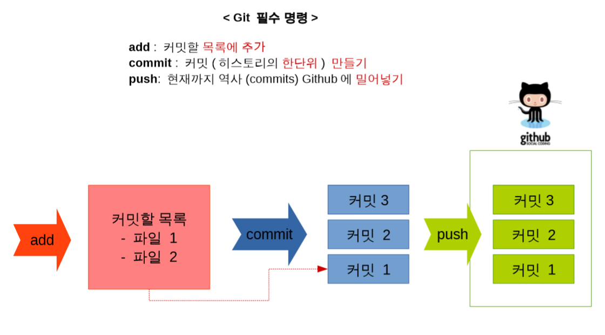
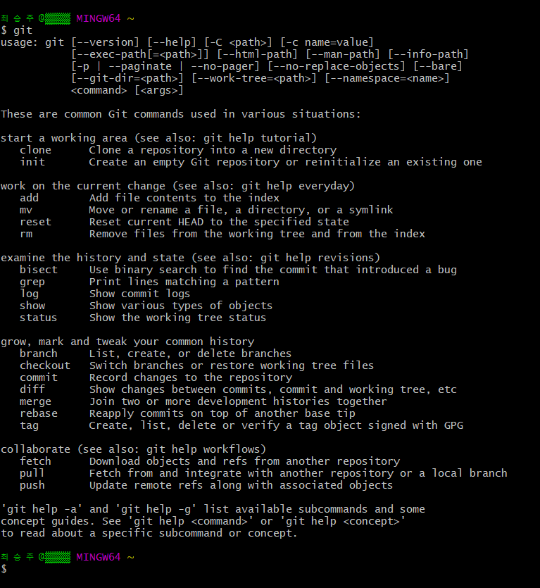
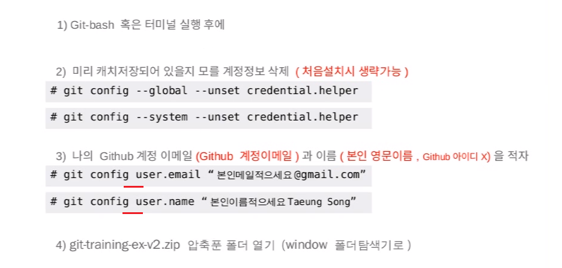

# 실습 준비

## 시나리오

깃이라는 것은 결국 개발자들에게는 소스코드를 개발하며 사용하는 도구 입니다. 즉 직접 C 프로그래밍을 짜면서 Git을 사용한다는 시나리오로 실습을 진행하겠습니다. 사용할 코딩들은 다운받았던 예제들에서 복사 해 사용하고 **Git은 직접 명령어를 입력**해서 사용하도록 하겠습니다.

그럼 실습에 들어가기에 앞서 꼭 알아둬야 할 지식에 대해 알아보겠습니다.

Git이라는 것은 History\(역사\), 즉 **변화하는 과정**의 역사를 **관리**하는 도구입니다. 이 위의 그림은 그런 역사들을 만들어 가는 **과정**이라고 볼 수 있습니다. 여기서 왼쪽의 **add** 명령어를 보고 역사를 하나 추가하는 명령어 라고 생각 하실 수도 있습니다. 그러나 add는 역사를 추가하는 것이 아닌 역사에 추가하고 싶은 일들을 하나의 목록으로 만들때 사용하는 명령어 입니다. 한마디로 **역사로 만들고 싶은 일들을 모으는 명령어**라고 생각할 수 있습니다. **Commit**은 이렇게 모은 역사들의 모임을 **역사의 한 단위**로 만드는 명령어 입니다. 이렇게 하나하나 쌓인 모임, 즉 블록들이 모여 하나의 **트리**를 이루게 됩니다.

여기서 조금 쉽게 예를 들자면 파일 1의 내용은 A단어를 B로 바꾸는 것이고 파일 2의 내용은 숫자 1을 3으로 바꾸는 내용입니다. 이런 내용을 변경했다는 점들만 모아서 역사, 즉 체크포인트로 만들고 싶은 일들을 모으는 작업이 add입니다. 그러고 이렇게 모인 역사들을 하나의 블록, 하나의 단위로 만드는 작업이 commit 입니다.

그리고 마지막으로 **push**는 지금까지 add와 commit이라는 오프라인에서 작업했던 것들을 GitHub에 올리는 명령어라고 생각하시면 됩니다.

## 설정

Git을 가지고 일을 해보기 전에 설정을 해야 할 것들이 있습니다. 일단은 **Git-bash**나 **터미널**을 실행 시킵니다. 이때 윈도우스 7이나 이상은 관리자 권한으로 실행시키는 걸 권장드립니다.

이제 명령창이 떴으면 그리고 거기에 **git** 이라고 입력하고 Enter을 눌러봅니다.

만약 위와 같은 텍스트들이 나온다면 성공적으로 git을 설치가 된 것입니다. 그러나 만약 알 수 없는 명령이다 이런 말이 뜬다면 설치가 제대로 안된 것 이기 때문에 다시 처음부터 설치를 해보셔야 합니다.

또한 만약 사용하시고 계시는 컴퓨터가 공동 사용이거나 실습실 등에서 사용된 컴퓨터라 이미 다른 사람의 Git 계정이 저장되어 있을 수 있기 때문에 아래 그림처럼 계정정보를 삭제 하셔야 할 수도 있습니다.

> **주의**
>
> 그림에서 **\# 는 생략**하고 따라 입력하셔야 합니다. \#를 같이 입력하면 명령어로 인식을 하지 않습니다.
>
> 또한 밑에 계정 입력부분에 git config **--global** user.email ~, git config **--global** user.name 으로 입력을 하셔야 합니다. **--global** 부분이 빠져있으니 꼭 입력해주시길 바랍니다. 또 " " 쌍따움표는 넣지 않습니다.
>
> 이름은 그냥 하시고 싶으신 것 넣으시면 됩니다.

이 과정을 성공적으로 잘 하셨다면 이제 아까 풀었던 git-training-ex-v2 폴더에 들어가 폴더들을 살펴 보겠습니다. 보시면 commit1, commit2 등 여러개의 파일들이 있고 commit1을 제외하고는 나머지는 똑같은 이름의 .c 파일이 들어있는 것을 확인 하실 수 있습니다. 이름은 똑같지만 내용은 다른 파일이라는 것 알아두시면 좋겠습니다.

이럼 이제 모든 준비가 다 끝났고 다음 장에서 진짜 실습을 나가보도록 하겠습니다.

