# 초기화 및 commit

## Stage 1

이제부터 본격적으로 Git을 이용해 실습을 해 보겠습니다. 실습을 하면서 어느정도 여유를 가지고 해본다는 마음으로 임하면 좋을 것 같습니다. 너무 깊게도 아니고 그렇다고 그냥 넘어가는 정도도 아닌 딱 적당한 선에서 **흐름을 이해** 한다고 생각하시고 실습하시면 될 것 같습니다.

먼저 터미널 또는 Git Bash를 이용해서 전 장에서 한 것 처럼 git 을 쳐서 메시지가 나오는지 확인을 합니다. 메시지가 잔뜩 뜨면 잘 설치가 되어있는 것이니 계속 진행 하시면 됩니다.

먼저 **cd ~** 를 쳐서 처음 경로로 들어갑니다. 리눅스의 경우엔 Home이고 윈도우스의 경우엔 C드라이브에 유저 이름 등으로 경로가 되어있을 것 입니다.

> cd / 을 쳐서 루트라는 곳에 들어가서 시작을 하면 권한 문제 때문에 에러가 날 수도 있다고 합니다. 그러므로 cd ~ 로 시작을 하는 걸로 합니다.

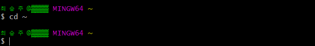

다음으로 새 폴더를 만들기 위해 **mkdir report-card** 를 칩니다. 이 명령어를 치기 전에 본인이 지금 어떤 경로에 들어와 있는지 알고 싶으시다면 **pwd** 를 치시면 현재 경로를 확인하실 수 있습니다.

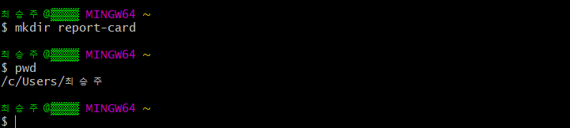

그럼 이제 cd 명령어를 이용해서 report-card를 만든 곳으로 이동해 보겠습니다. **cd report-card** 를 입력해 이동합니다. 이동이 잘 됬는지는 위의 pwd를 이용해 보실 수 있습니다. 실제로 이 경로\(저 같은 경우엔 /c/Users/이름/report-card\)를 따라가 보시면 폴더가 만들어져 있는 걸 확인 하실 수 있습니다.

> 혹시 Git Bash를 종료하셨다 다시 시작할 일이 있으시다면 cd report-card 명령어를 통해 다시 report-card 폴더로 경로를 이동하셔야 합니다.

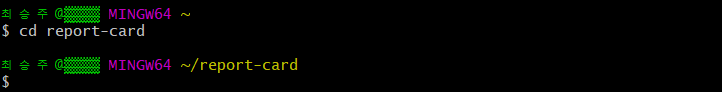

그럼 이제 Git Bash나 터미널, 방금 만든 report-card 폴더 그리고 전 장에서 다운받아 압축을 풀어 놓았던 commit들이 들어있는 git-training-ex-v2 폴더, 이렇게 3개의 준비물이 모두 다 갖춰졌을 것 입니다.

이 상태에서 **git init** 을 해 보도록 하겠습니다. git init은 해당 폴더를 git 초기화 시키는 명령어 입니다. 그럼 Initialized empty Git repository 라며 메시지가 뜨게 됩니다.

이 git init은 비쥬얼 스튜디오나 이클립스로 새로운 프로젝트를 시작하는 것처럼 Git으로 관리하는 새 프로젝트 시작하기 라는 명령어로 생각하시면 됩니다.

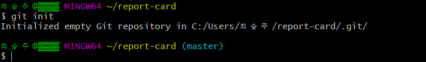

다시 돌아와 이 상태에서 **ls -A** 를 치게 되면 경로 안에 있는 폴더, 파일 등을 전부 확인 할 수 있습니다. 그러면 **.git/** 이라는 것을 볼 수 있는데 이것은 git으로 History를 관리하기 위해 필요한 파일이라고 보시면 됩니다. 참고로 경로에 따라간다고 해도 숨김 폴더이기 때문에 보이지는 않습니다.

이제 **git add report\_card.pdf** 라는 명령어를 쳐 보겠습니다. 그러면 **오류**가 나시는 것을 볼 수 있습니다. 그 이유는 **ls** 로 폴더 안에 있는 것들을 확인을 해보시면 비어있기에 당연히 나는 오류 입니다.

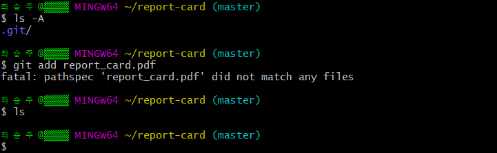

그렇다면 저 report\_card.pdf 파일은 어디에 있는지 궁금하실 것 입니다. 이 파일은 아까 저희가 열어놓은 **git-training-ex-v2 안의 commit1 폴더 안**에 있습니다. 이제 이 pdf 파일을 복사해서 report-card 경로로 가셔서 붙여넣습니다. 그리고 나서 ls를 해 보시면 이제 목록에 report\_card.pdf 가 있는 것을 확인하실 수 있습니다.

앞으로의 진행은 이처럼 중간중간에 commit들에 있는 파일을 복사해서 Git으로 지정한 폴더 안에 넣고 git 을 사용하고의 과정을 반복할 것입니다.

그럼 이제 파일을 진짜 넣어봤으니 **git add report\_card.pdf** 를 다시 쳐보겠습니다. 그럼 이번에는 아무 문제 없이 진행될 것입니다.

그럼 이제 git에 pdf 파일이 성공적으로 들어가게 된 것입니다. 이제 여기서 **git status** 를 이용해 git의 상태를 한번 봐 보겠습니다.

> 만약에 warning: LF will be replaced by CRLF in report\_card.c 라는 경고가 뜬다면 윈도우의 줄 바꿈 문자와 리눅스의 줄 바꿈 문자가 다른 걸 사용해 나오는 경고 문이니 걱정 하지 않으셔도 됩니다.

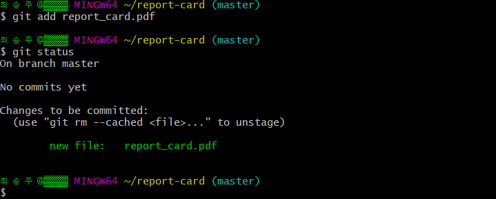

그럼 이제 commit을 할 목록까지 만든 것 입니다. 즉 

Add를 한 후에 빨간색 상자까지 진행한 상태입니다.

그럼 이제 commit을 해 볼 것입니다. commit을 해 줄때에는 " " 안에 왜 commit을 했는지 이유를 기록으로 남길 수 있습니다. **git commit -m "report card: Add question PDF"** 를 해 commit을 해 봅니다.

그리고 **git shortlog** 를 입력해서 **\(1\)**이 뜬다면 성공적으로 commit을 한 것 입니다.

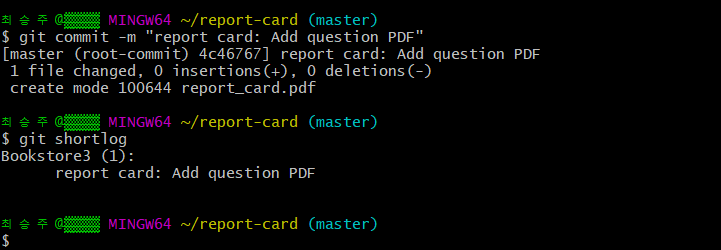

만약 여기까지 했는데 \(1\)이 안 뜬다면 따라하시던 도중 빠뜨리신 부분이 있는 것이니 다시 천천히 따라해 주시면 되겠습니다.

자 그럼 이제 report\_card.c를 추가해보기 위해 또 **git add report\_card.c** 를 해보겠습니다. 눈치 채셨겠지만 당연히 이 파일도 없으니 오류가 뜹니다. 그럼 아까했던 것과 비슷하게 이번엔 commit2 폴더에서 .c파일을 가져와 report-card 폴더에 넣어줍니다.

그리고 다시 **git add report\_card.c**를 해줍니다. 그리고 또 **git status** 를 하면 commit을 할 목록으로 .c 파일이 추가 된 것을 알 수 있습니다.

그리고 이제 commit을 위해 **git commit -m "report card: Add base code"**를 입력을 해 commit을 해 줍니다.

다 됬으면 이번엔 **git show** 를 하게되면 최신으로 추가된 파일에 들어있는 내용을 볼 수 있습니다. 내용에는 commit ID, 저자 이름, 추가 날짜, 어떤 내용인지, 소스 내용등을 볼 수 있습니다.

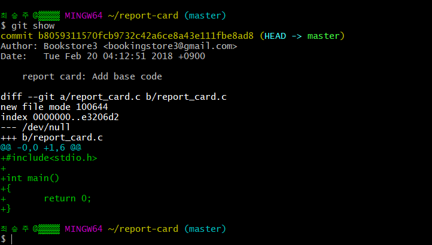

여기까지 성공을 하셨지만 약간 이해가 안 가시는 부분이 있더라도 계속 진행을 하다보면 이해를 하실 수 있으니 너무 걱정 하지 않으셔도 됩니다.

## Stage 2

자 그럼 **git status** 를 입력하고 **git shortlog** 도 입력해 보겠습니다. 그럼 먼저 nothing to commit, working tree clean 이라는 메시지를 확인 하실 수 있습니다.

그럼 먼저 status 부분에서는 저희는 add 한 것들을 이미 다 commit해 역사로 만들어 버린 상태이기 때문에 add하고 commit을 기다리는 파일들이 없다는 의미에서 nothing to commit, working tree clean이라고 뜨게 되는 것 입니다.

shortlog 에서는 지금까지 2개의 History를 commit 했기 때문에\(.pdf 와 .c\) 숫자 2를 보실 수 있습니다.

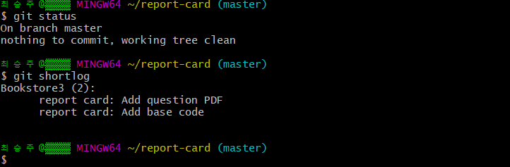

자 그럼 이제 commit**3** 폴더에 있는 report\_card.c를 복사해 report-card에 복사 붙여넣기를 합니다. 당연히 이름이 같기 때문에 덮어 쓸 것이냐는 경고문이 뜰 것입니다. 그대로 덮어 씌우시면 됩니다.

이렇게 되면 원래있던 report\_card.c 파일에 변화가 생긴 것 입니다. 이러한 변화된 부분을 **git diff** 로 확인 할 수 있습니다.

전에 있던 파일과의 변경된 부분은 아래와 같이 초록색으로\(printf\(\) 부분\) 표시가 되어 어느 부분이 변경 된 것인지를 알 수 있습니다.

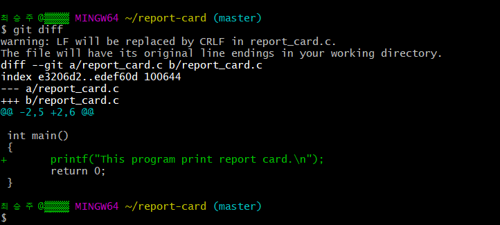

이렇게 확인을 했다면 아까 했던 add를 할 차례입니다. 그럼 먼저 **git add report\_card.c** 로 commit할 목록을 add 해줍니다. 그리고 나서 **git status**로 확인을 하면 modified: report\_card.c, 즉 변화가 된 부분을 commit할 목록으로 add 한 것을 볼 수 있습니다.

그리고 나서 아까 한 것처럼 **git commit -m "report card: Print a message of introduction"** 이라고 commit을 합니다.

이제 **git show** 를 사용해서 최신으로 변경된 파일을 확인해 보면 기록이 잘 된 것을 확인 할 수 있습니다.

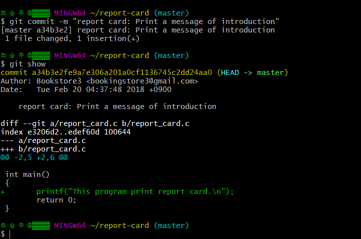

여기서 **git log** 를 해보면 지금까지 commit 한 것들을 볼 수 있습니다. 물론 여기서 git shortlog 를 해보면 \(3\) 이 나올 것입니다.

이제 또 아까처럼 commit**4**에 있는 파일을 report-card 폴더 파일에 덮어 씌우겠습니다. 그럼 당연히 또 변화 부분이 있을테니 **git diff**를 해보면 차이점들이 또 일어났다는 것을 알 수 있습니다.

그럼 이제 자연스럽게 git add report\_card.c 를 add 해서 commit 준비를 시키고 git status로 변화 부분이 add가 되었는지 확인, 그 후 **git commit -m "report card: Print grades of each subject"** 해서 commit을 해 줍니다.

그럼 commit이 되고 또 git log와 git shortlog를 해서 지금까지 한 4개의 commit을 확인 해 봅니다.

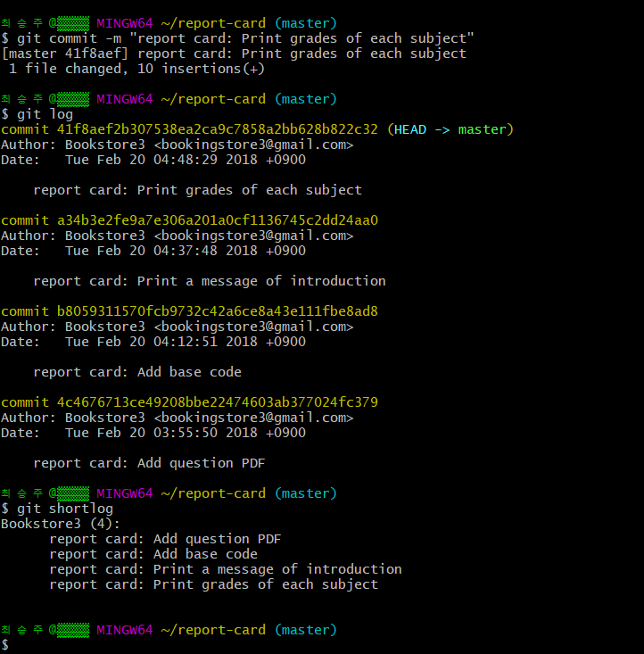

여기까지 해서 commit 4개가 확인이 되었다면 정상적으로 commit들을 잘 하신 것 입니다.

## Stage 3

자 또 아까의 반복으로 이번엔 commit**5**에 있는 파일을 복사해서 report-card 폴더 안에 또 덮어쓰기를 합니다. 이번에도 git diff를 치시면 변화된 부분을 볼 수 있습니다.

그럼 또 git add report\_card.c 를 해서 add를 해 commit 목록을 만들고 거기에서 commit을 예정입니다만 이번에는 **서명을 포함 해 commit**을 해 보겠습니다.

서명을 포함을 하려면 commit을 할 때 -m이 아닌 **-sm**을 통해 할 수 있습니다. 즉, **git commit -sm "report card: Show the sum of each grade"** 를 입력 하시면 됩니다.

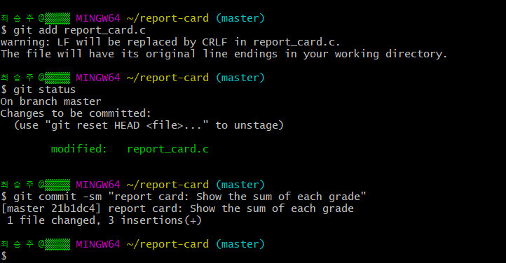

이제 여기서 방금 한 작업을 보기 위해 git show를 해 보시면 **Signed-off-by: 이메일 주소&lt;예시 Email@Address.com&gt;** 가 있는 것을 볼 수 있습니다.

> 만약 여기까지 왔는데 **:** 상태에서 진행이 안되신다면 **q** 를 누르시면 됩니다.

그리고 나서 **git log -p** 를 하게 되면 자세한 내용을 볼 수 있는데 여기서 이전 commit에는 Signed-off-by 가 없는 것을 확인 하실 수 있습니다.

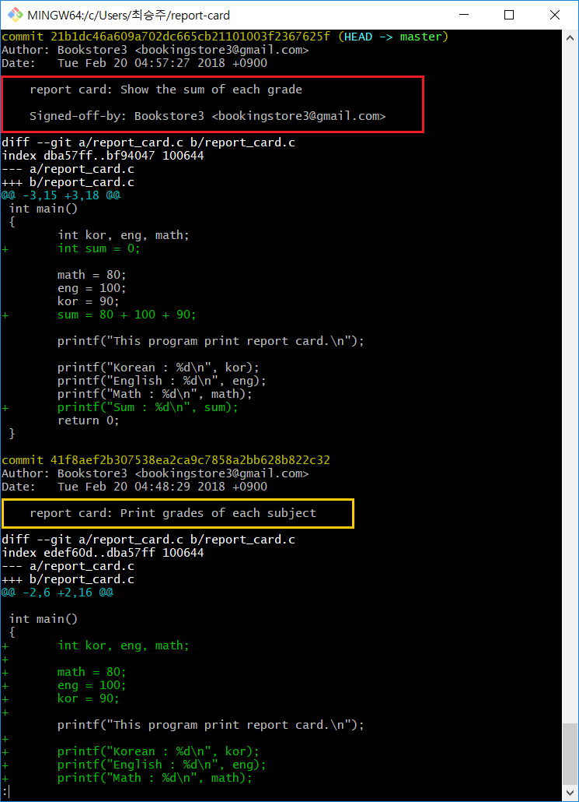

즉 commit에 서명이 **-s**를 통해 들어간 것 입니다. 이러한 서명을 하는 이유는 Git에 올리는 경우에는 오픈 소스로서 개발을 많이 하게 됩니다. 그렇기 때문에 누가 어떤 부분을 했는지 **명확하게** 하기 위해서 서명을 추가하는 것 입니다.

이제 또 똑같이 commit**6**에 있는 파일 복사 덮어씌우기 과정을 진행합니다.

그럼 또 git add report\_card.c 를 하고 git status로 확인 한번 해 준 다음에 git commit -sm "report card: Get a average of grades" 로 commit 까지 해 줍니다.

여기까지 하면 git shortlog로 보면 총 6개의 commit이 만들어져 있는 것을 확인 할 수 있습니다.

## 정리

여기까지가 실습 Stage 1부터 3까지의 과정으로 add, commit, -s, diff, status, shortlog, log, show 등 git의 commit하는 기능 및 다른 기능들에 대해 알아보았습니다. 다음 장부터 Stage 4로 계속 진행해 나가겠습니다.

> 혹시 Git Bash를 나가셨다면 cd report-card 명령어를 통해 다시 report-card 폴더로 경로를 이동하셔야 지금까지 한 commit들이 있습니다.

