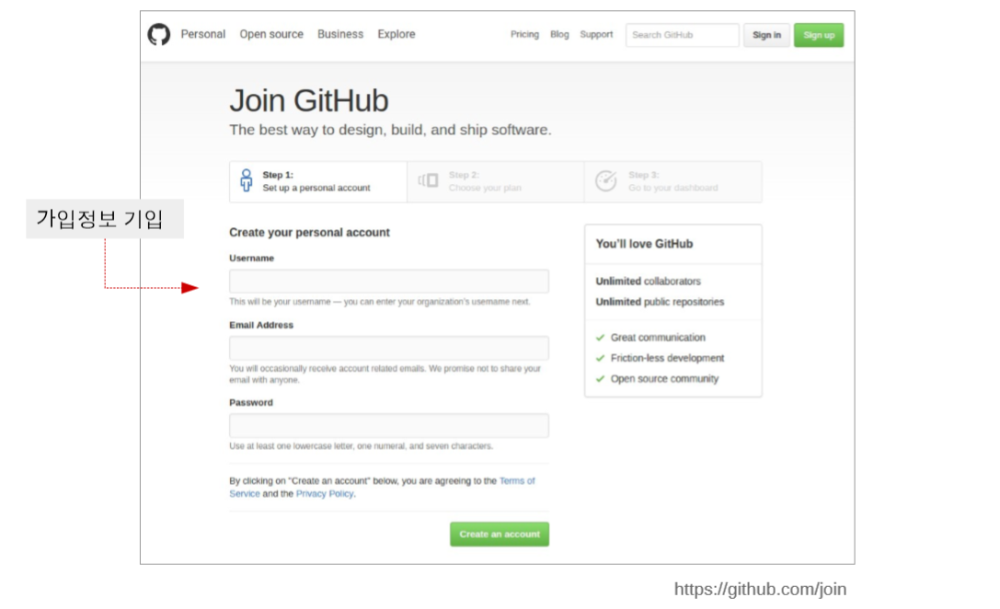
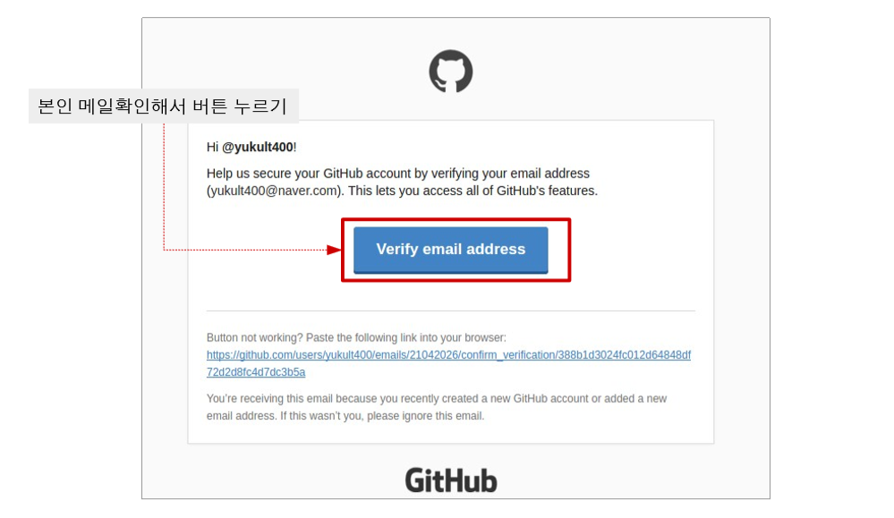
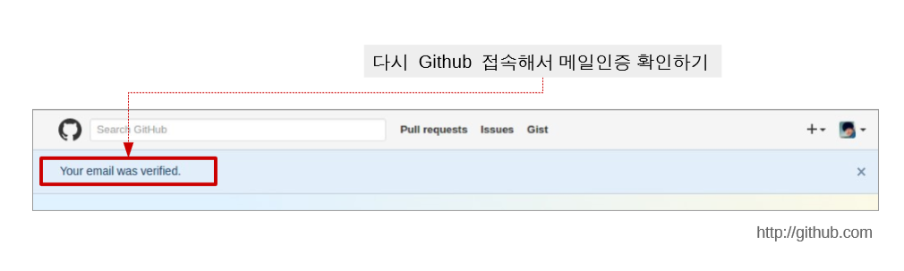
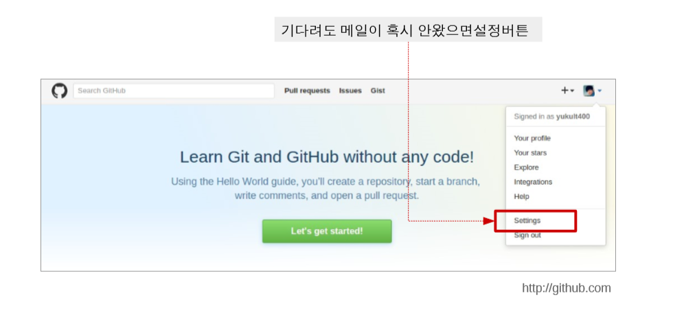
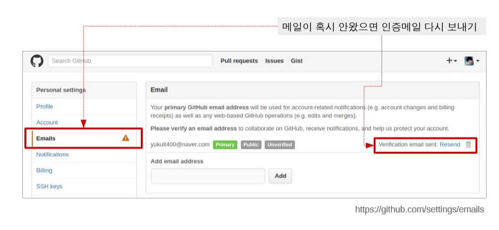

# 소개 및 준비

## 소개

이 강의는 지루하게 깃에 대한 이론적인 부분만을 설명하는 강의가 아닌 **실전**을 통해 실제로 깃을 사용하는 법을 배우자는 취지로 만들어졌습니다.

처음 저희가 스마트폰을 사용할 때 사용 설명서 없이 이것저것 직접 해보며 배운 것 처럼 깃이란 프로그램 또한 일단 써보면서 이해 하자는 취지입니다.

### Git 이란

Git이란 개발과정, 소스파일 등을 관리하는 도구로서 **History가 관리**되어 특정 시점으로 **복구가 가능**하고 지금까지 어떤 **변화**들이 있었는지 **과정**을 볼 수 있게 해주는 프로그램입니다.

지금까지 각종 프로젝트, 과제 등을 하면서 파일 이름을 과제1 최종, 과제1 진짜 최종, 과제1 진짜 진짜 최종 등으로 수정이 있거나 추가 사항이 있었던 파일들을 이런식으로 이름을 지어 관리 한 경험들이 있을 것 입니다.

그러나 이런 Ctrl c v로 파일을 복사한 관리법은 파일간에 **어떤 내용이 바뀌었는지 알 수 없고** 복사를 하면 할 수록 **용량은 배**가 됩니다.

그러나 Git을 사용해 관리를 하게 되면 파일 간에 어떤 차이가 있는지 **왜 수정을 했는지 기록**을 남길 수 있습니다. 또한 현재 가지고 있던 파일들은 안전하게 내버려둔 상태로 과거의 한 순간으로 **복원이 가능**합니다. 또한 각 파일 버전 별 차이만 저장을 하기에 관리하는 **용량 또한 감소**하게 됩니다.

물론 이런 유용한 기능이 있다는 것은 알겠지만 그렇다고 겨우 이런 차이 때문에 깃을 따로 공부하는 시간이 아까울 수 있습니다. 이런 궁금증에 대한 답은 질문보단 실전을 통해 알아보도록 하겠습니다.

> Don't think about git, just do git

## 준비

먼저 깃을 사용하기 위해서 준비물과 깃에 회원가입 및 설치를 할 필요가 있습니다.

먼저 [이곳](https://github.com/Taeung/git-training)\([https://github.com/Taeung/git-training\)에](https://github.com/Taeung/git-training%29에) 들어가 밑에 Git Training에 있는 1. Download tutorial에 **tutorial v3**와 **example code v2**를 다운로드 받습니다. ****

그리고 [이곳](https://git-scm.com/downloads)\([https://git-scm.com/downloads\)에](https://git-scm.com/downloads%29에) 가셔 깃을 다운로드 받아 **설치**하셔야 합니다.

마지막으로 [이곳](https://github.com/join)에 가셔서 깃허브에 **회원가입**을 하시면 됩니다.

회원가입에 대한 절차는 사진으로 보여드릴테니 따라서 하시면 됩니다.

다 다운도 받으셨고 설치도 다 하셨다면 git-training-ex-v2.zip 압축을 풀어놓으시면 됩니다.

그럼 이상으로 Git의 간략한 소개와 준비 단계였고 다음 장에서 실습 준비로 넘어가겠습니다.

